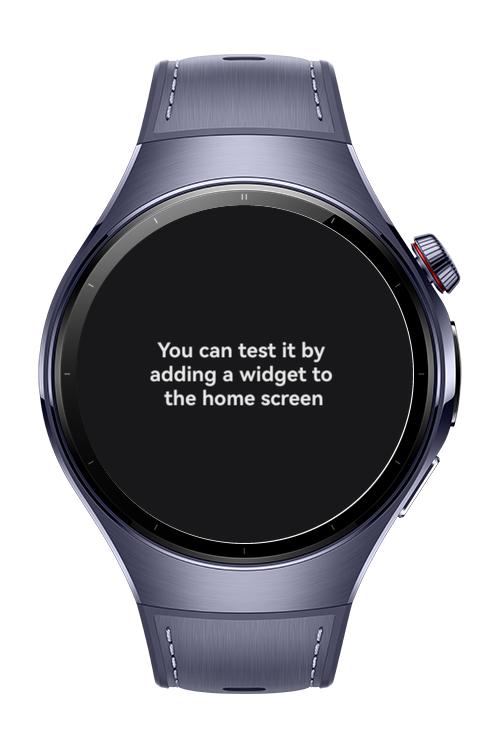
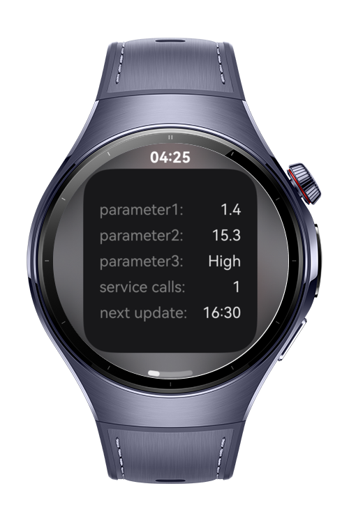
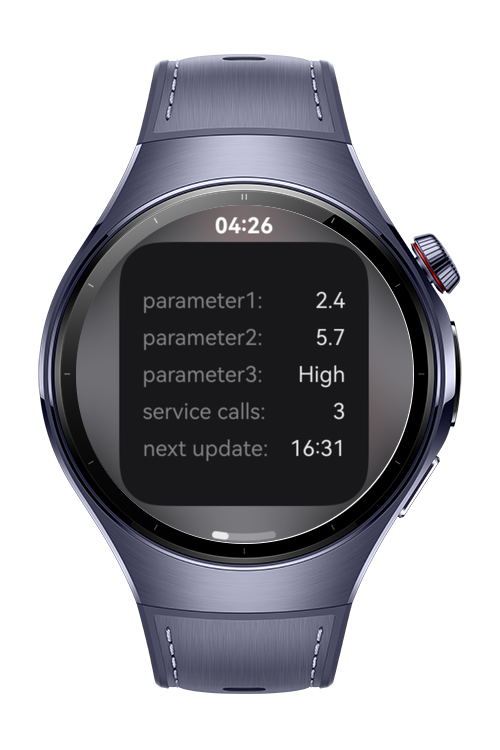

> **Note:** To access all shared projects, get information about environment setup, and view other guides, please visit [Explore-In-HMOS-Wearable Index](https://github.com/Explore-In-HMOS-Wearable/hmos-index).

# HarmonyOS Self-Refreshing Service Widget

A HarmonyOS ArkTS service widget that displays live data on the home screen, auto-refreshes every 5 minutes via `FormExtensionAbility`, and persists call statistics across restarts using `preferences`.

# Preview

  
  
  
  

# Use Cases
- Display live, periodically-updated data (e.g. metrics, status, forecasts) directly on the home screen without opening the app
- Track and surface usage statistics (call count, next scheduled update) that survive process death and device reboot
- Manual refresh on tap, in addition to the automatic 5-minute cycle

# Technology

## Stack
- HarmonyOS ArkTS / ArkUI (declarative UI)
- FormKit (`FormExtensionAbility`, `formBindingData`, `formProvider`, `postCardAction`)
- ArkData `preferences` (persisted key-value storage)
- AbilityKit, BasicServicesKit, PerformanceAnalysisKit (`hilog`)

## Required Permissions
- None required for the base implementation (widget data is generated locally and stored via `preferences`)
- Add network/location permissions here only if the mock data source (`MockDataService`) is replaced with a real external data source

# Directory Structure

    entry/src/main/
    ├── ets/
    │   ├── pages/
    │   │   ├── Index.ets              # standalone app preview screen
    │   │   └── WidgetsView.ets        # widget UI, bound via @LocalStorageProp
    │   ├── services/
    │   │   ├── WidgetModel.ets        # data model
    │   │   ├── MockDataService.ets    # simulated async data fetch
    │   │   └── CallStatsService.ets   # persisted call count / next-update tracking
    │   └── entryformability/
    │       └── EntryFormAbility.ets   # form lifecycle, refresh scheduling
    ├── resources/base/
    │   ├── element/
    │   │   └── string.json            # widget_label, widget_description, widget_display_name
    │   ├── media/
    │   │   └── widget_icon.png
    │   └── profile/
    │       └── form_config.json       # form dimensions, entry src, update behavior
    └── module.json5                   # extensionAbilities registration

# Constraints and Restrictions
- Refresh interval cannot go below the system-enforced floor of 5 minutes, regardless of `REFRESH_INTERVAL_MINUTES` value
- `form_config.json` currently declares only `3*3` as a supported dimension — additional sizes require separate layout handling in `WidgetsView.ets`
- `updateDuration: 0` disables system auto-scheduling entirely; all refresh timing depends on `scheduleNextRefresh()` completing successfully — a failure there breaks the refresh chain silently unless logged (see `hilog.error` in `EntryFormAbility`)
- Data source is currently mocked (`MockDataService`); no real network calls are made

## Supported Devices
- Watch 5

# License
how-to-implement-self-refreshing-widget is distributed under the terms of the MIT License. 
See the [LICENSE](/LICENSE) for more information.